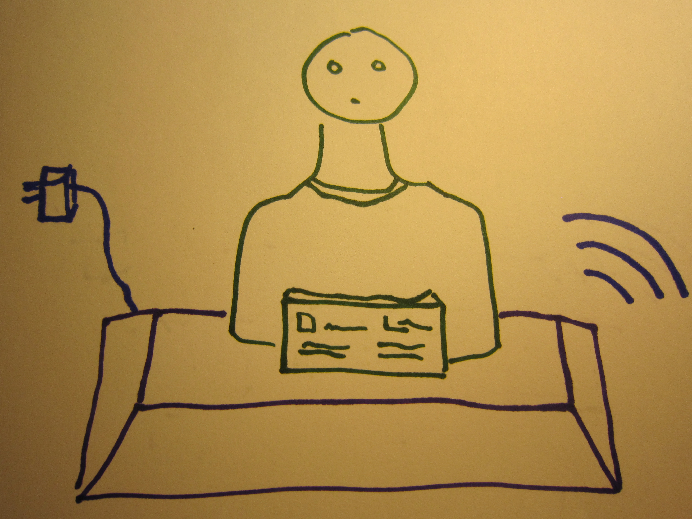

# Monument

A monument is a celebration of someone's impact on the world, and of the empty void they leave behind them.

These days, your legacy is manifested as much in intangible media is it is in physical reality.

Celebrate your loved ones with a monument for the digital age.

## What is it?

Monument celebrates not only your loved one's contributions to the physical world, but to the digital world as well.

It combines a beautiful 3d-printed bust with a webserver that displays things the subject made, reflections and memories by friends and loved ones, and a biography of the depicted.
